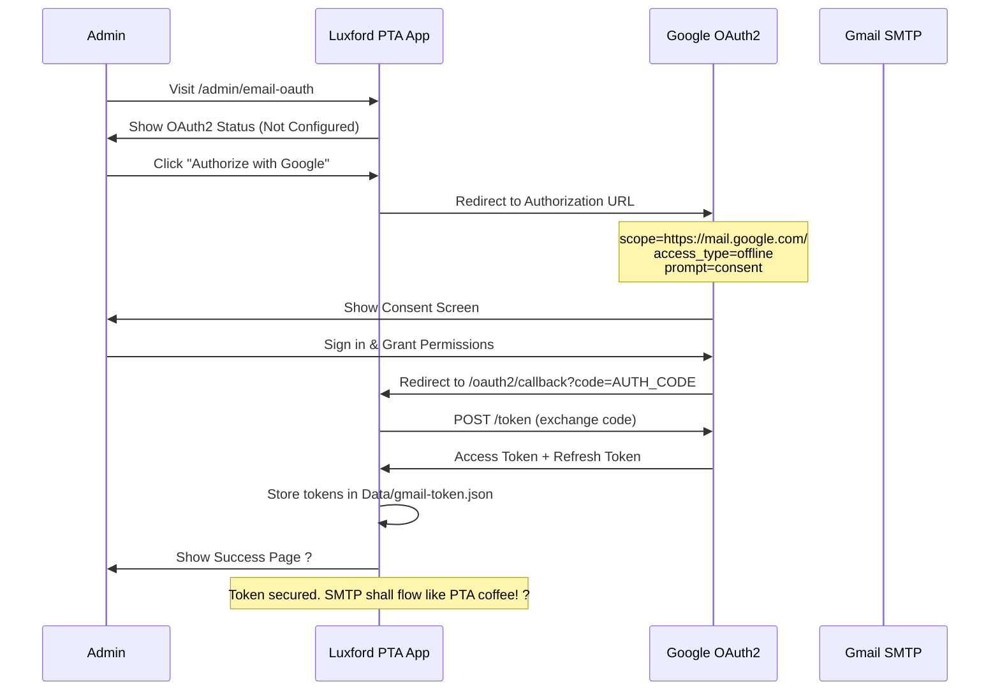
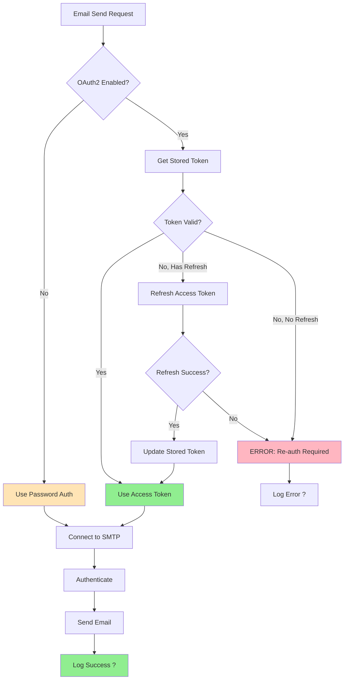
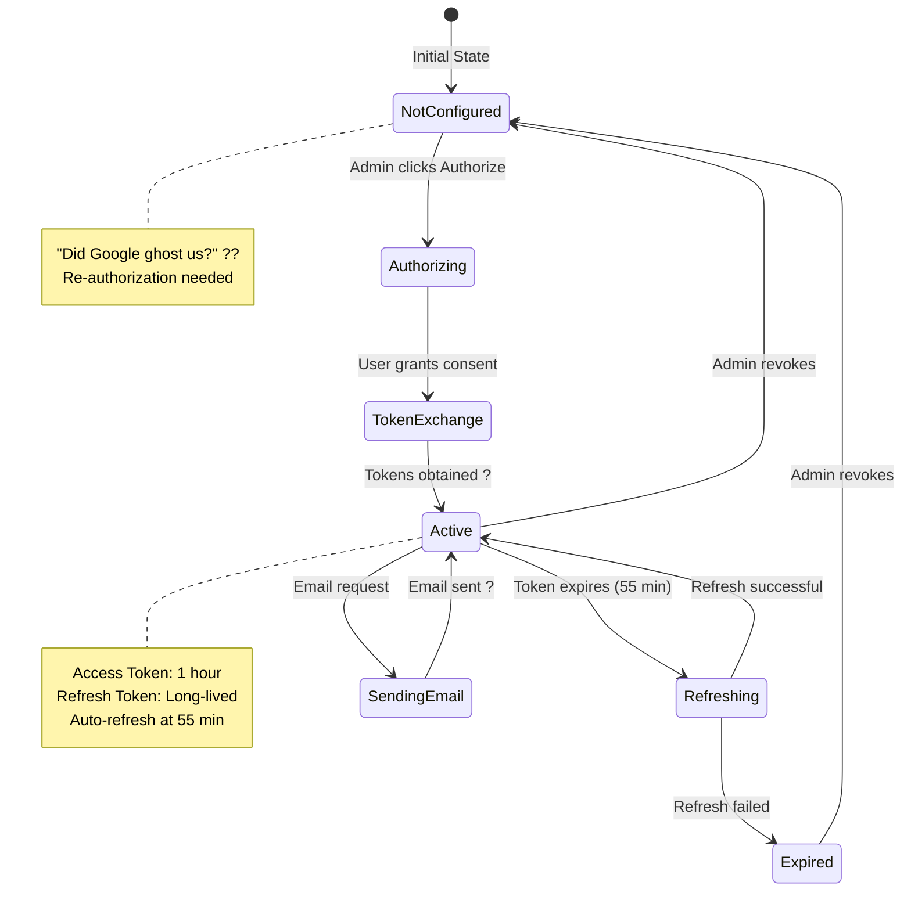
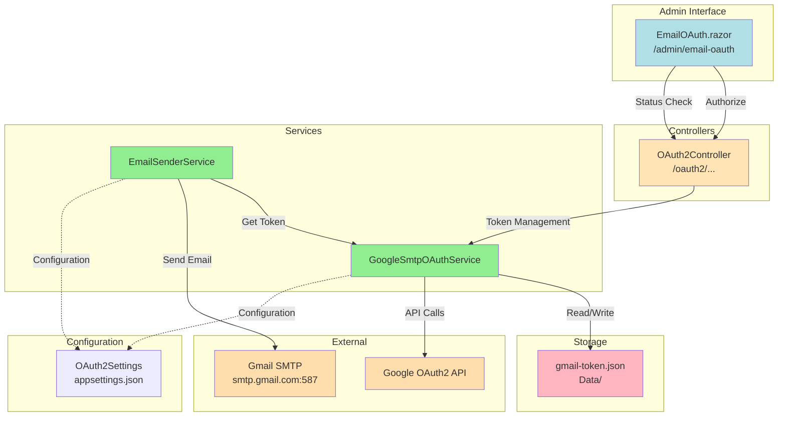
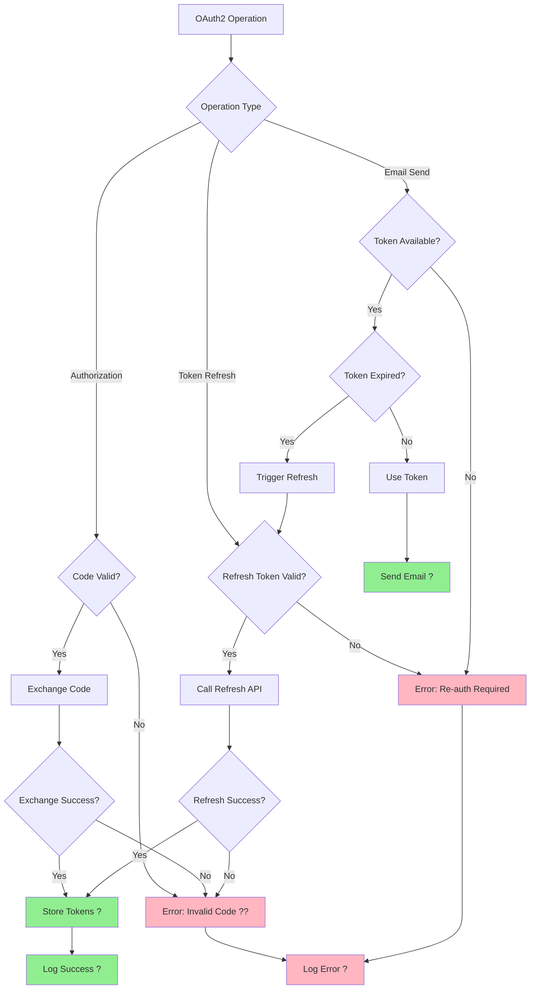
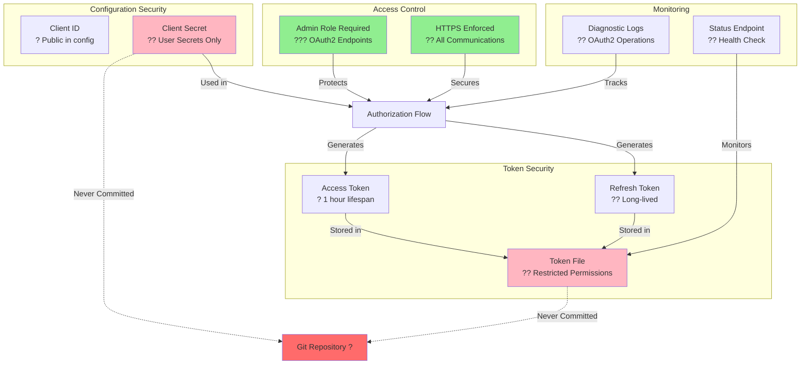

# Gmail OAuth2 Flow Diagrams

## Authorization Flow



## Email Sending Flow



## Token Lifecycle



## Architecture Overview



## Component Interaction

```mermaid
graph LR
    subgraph "Application Startup"
        Program[Program.cs] -->|Register Services| DI[Dependency Injection]
        DI -->|Configure| OAuth2Settings
        DI -->|Create| OAuthService[GoogleSmtpOAuthService]
        DI -->|Create| EmailService[EmailSenderService]
    end
    
    subgraph "OAuth2 Flow"
        Admin -->|Visit| AdminUI[/admin/email-oauth]
        AdminUI -->|Click Authorize| Controller[OAuth2Controller]
        Controller -->|Generate URL| OAuthService
        Controller -->|Exchange Code| OAuthService
        OAuthService -->|Save| TokenStorage[(Token File)]
    end
    
    subgraph "Email Sending"
        App[Application] -->|Send Email| EmailService
        EmailService -->|Get Token| OAuthService
        OAuthService -->|Load| TokenStorage
        OAuthService -->|Refresh if needed| GoogleAPI[Google API]
        EmailService -->|Authenticate| SMTP[Gmail SMTP]
    end
    
    style Admin fill:#87CEEB
    style TokenStorage fill:#FFB6C1
    style GoogleAPI fill:#FFDEAD
    style SMTP fill:#FFDEAD
```

## Error Handling Flow



## Security Model



## Deployment Flow

```mermaid
flowchart LR
    subgraph "Google Cloud Console"
        GCP1[Enable Gmail API]
        GCP2[Create OAuth2 Client]
        GCP3[Configure Redirect URIs]
        GCP1 --> GCP2 --> GCP3
    end
    
    subgraph "Application Setup"
        APP1[Update appsettings.json<br/>OAuth2Settings]
        APP2[Set Client Secret<br/>User Secrets]
        APP3[Deploy Application]
        APP1 --> APP2 --> APP3
    end
    
    subgraph "Authorization"
        AUTH1[Admin Login]
        AUTH2[Visit /admin/email-oauth]
        AUTH3[Click Authorize]
        AUTH4[Grant Permissions]
        AUTH5[Tokens Stored ?]
        AUTH1 --> AUTH2 --> AUTH3 --> AUTH4 --> AUTH5
    end
    
    subgraph "Production Enable"
        PROD1[Set EnableOAuth2: true]
        PROD2[Restart Application]
        PROD3[Test Email Sending]
        PROD4[Monitor Logs ?]
        PROD1 --> PROD2 --> PROD3 --> PROD4
    end
    
    GCP3 --> APP1
    APP3 --> AUTH1
    AUTH5 --> PROD1
    
    style GCP3 fill:#FFDEAD
    style AUTH5 fill:#90EE90
    style PROD4 fill:#90EE90
```



---

## Legend

- ? Success / Completed
- ? Error / Failed
- ?? Secured / Encrypted
- ? Time-limited
- ?? Renewable
- ??? Protected
- ?? HTTPS/Secure
- ?? Logged
- ?? Monitored
- ? Coffee-powered
- ?? OAuth2 ghost error

---

## Viewing These Diagrams

These diagrams use [Mermaid](https://mermaid.js.org/) syntax and can be viewed in:

1. **GitHub** - Automatically rendered in markdown files
2. **VS Code** - Install "Markdown Preview Mermaid Support" extension
3. **Mermaid Live Editor** - Copy/paste at https://mermaid.live/
4. **Documentation Sites** - GitBook, Docusaurus, MkDocs, etc.

---

## Quick Reference

### Authorization Flow
Shows the complete user journey from admin UI to token storage.

### Email Sending Flow
Demonstrates how emails are sent with automatic token refresh.

### Token Lifecycle
State diagram of token states and transitions.

### Architecture Overview
High-level component relationships and data flow.

### Component Interaction
Detailed service dependencies and interactions.

### Error Handling Flow
Comprehensive error scenarios and recovery paths.

### Security Model
Security layers and protection mechanisms.

### Deployment Flow
Step-by-step deployment and authorization process.

---

**Token secured. Diagrams complete. SMTP shall flow like PTA coffee!** ?
